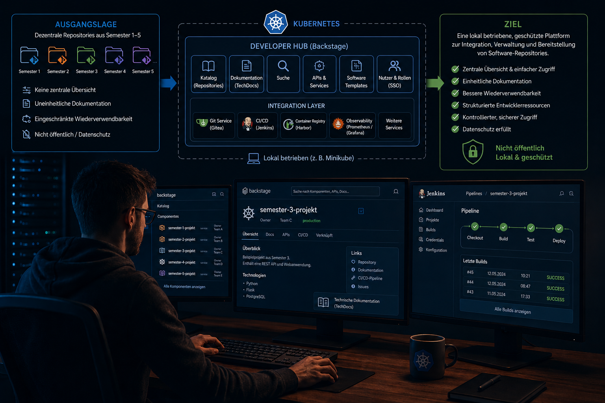

# Ausgangslage / Projektidee

Im Verlauf der bisherigen Ausbildung wurden mehrere Softwareprojekte und Semesterarbeiten erstellt, die in unterschiedlichen Repositories abgelegt sind. Diese sind aktuell dezentral organisiert, teilweise uneinheitlich dokumentiert und nur eingeschränkt wiederverwendbar. Dadurch fehlt eine zentrale Übersicht über vorhandene Projekte sowie ein einheitlicher Zugriffspunkt für Entwicklerressourcen, was die Nutzung und Weiterentwicklung bestehender Arbeiten erschwert. 

Gleichzeitig besteht das Potential, diese Repositories in einer zentralen Plattform zu bündeln, um eine strukturierte, übersichtliche und wiederverwendbare Sammlung von Entwicklerressourcen zu schaffen. Dabei ist zusätzlich zu berücksichtigen, dass die enthaltenen Arbeiten persönliche oder schulische Inhalte umfassen und daher nicht öffentlich zugänglich gemacht werden dürfen. Daraus ergibt sich die Anforderung, eine lokal betriebene, geschützte Lösung zu entwickeln. 

Im Rahmen dieser Semesterarbeit wird deshalb ein Proof of Concept (PoC) für einen Kubernetes basierten Developer Hub konzipiert und umgesetzt. Ziel ist es, eine zentrale Plattform zu schaffen, in der bestehende Software-Repositories aus den Semestern 1–5 integriert, verwaltet und zugänglich gemacht werden. 

Der Fokus liegt auf dem Aufbau einer containerisierten Infrastruktur mittels Kubernetes sowie der Implementierung eines Developer Hubs als zentrale Schnittstelle für Entwicklerressourcen. Die Plattform wird ausschliesslich in einer lokalen, nicht öffentlich zugänglichen Umgebung (z. B. mittels Minikube) betrieben, um Datenschutzanforderungen zu erfüllen und den Zugriff kontrolliert zu halten. 

Optional wird im weiteren Verlauf geprüft, inwiefern eine Integration von Künstlicher Intelligenz zur Unterstützung bei der Analyse, Dokumentation oder Suche innerhalb der Repositories möglich ist. 

**Die zentrale Fragestellung lautet:** 
*Wie kann ein Kubernetes-basierter Developer Hub als lokal betriebene, geschützte Plattform konzipiert und umgesetzt werden, um bestehende Software-Repositories effizient zu integrieren und zugänglich zu machen?*

Unter diesem Link kannst du das Einreichungsformular einsehen: [Einreichungsformular](../../ressources/docs/ITCNE24_Semesterarbeit_5_Einreichungsformular_Miguel_Schneider.pdf) 

[Quelle](../Quellverzeichnis/index.md#ausgangslage) 