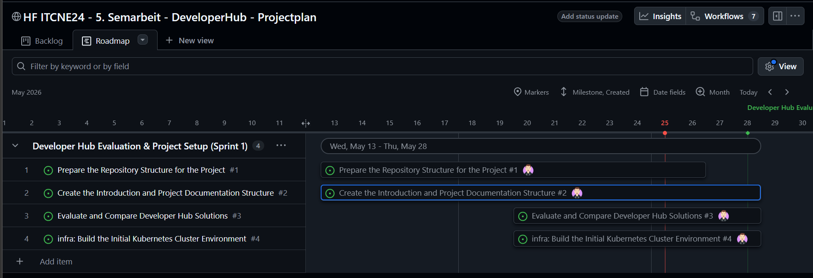
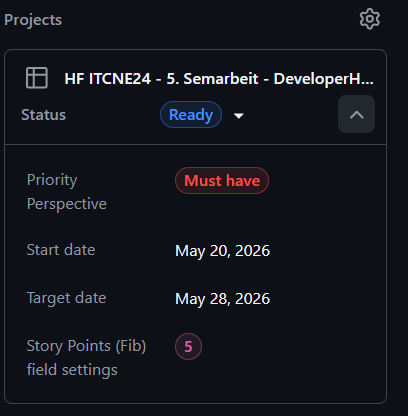

# Zeitplan

Um meine Semesterarbeit strukturiert voranzutreiben, habe ich zwei unterschiedliche Zeitpläne erstellt. Diese Zeitpläne variieren in ihrer Detailtiefe und bieten mir somit verschiedene Ansätze zur Organisation meiner Arbeit.

Dies ist der grobe Zeitplan, welchen ich aus dem [Einreichungsformular](../../ressources/docs/ITCNE24_Semesterarbeit_4_Einreichungsformular_Miguel_Schneider.pdf) entnommen habe. 

| Datum               | Aktivität                                                      | Wer                                                 | Empfänger                        |
| ------------------- | -------------------------------------------------------------- | --------------------------------------------------- | -------------------------------- |
| 15.04.26            | Ablauf Semesterarbeiten und Liste mit Projektthemen vorstellen | Lehrgangsleitung                                    | Studierende                      |
| 05.05.26            | Abgabe der Vorschläge für die Semesterarbeit & Kick-Off        | Studierende                                         | Experte/innen & Lehrgangsleitung |
| 29.05.26 / 01.06.26 | Individuelle Zwischenpräsentation mit Rückmeldung 1            | Studierende, Experte/innen & Lehrgangsleitung       | Experte/innen                    |
| 19.06.26 / 22.06.26 | Individuelle Zwischenpräsentation mit Rückmeldung 2            | Studierende, Experte/innen                          | Experte/innen                    |
| entfällt            | Individuelle Zwischenpräsentation mit Rückmeldung 3            | Experte/innen                                       | Experte/innen                    |
| 08.07.26            | Abgabe der Arbeit / Abnahme mit Schlusspräsentation            | Studierende, Experte/innen                          | Experte/innen                    |
| 15.07.26            | Notenvorschlag                                                 | Experte/innen, Projekt-Experte/in, Lehrgangsleitung | Lehrgangsleitung                 |

Den genaueren Zeitplan habe ich im Projektmanagement in Github erstellt. 
Dies ist ein Kanban-Board, auf dem ich die Einzelnen Tasks und verschiedene Buckets habe. 
Mit diesem Board, kann ich auch eine Zeitplan-Achse abbilden, wo ich die Dauer eines Tasks definieren kann. 

Den Zeitplan in GitHub Project, kannst du unter diesem Link finden: <a href="https://github.com/users/Radball-Migi/projects/10" target="_blank">Github Project</a>

Mit GitHub Project, gibt es die Möglichkeit, die einzelnen Schritte in einer Roadmap anzuzeigen. 
Dies sieht dann in etwa so aus:

[*Roadmap in GitHub Projects*](https://github.com/users/Radball-Migi/projects/10/views/4)

Der Vorteil dabei ist, dass ich eine graphisch übersichtliche Zeitplanung habe, in der ich Visuell meine Tasks sehe (Balken mit dem Status des Issues), inklusive meinen Meilensteinen (Grüne Linie auf dem Zeitstrahl). 

**Zusätzlich werde ich die Methoden, welche ich in der vergangenen Semesterarbeit neu kennengelernt und angewendet habe, auch in diesem Semester erneut einsetzen:**  
Dazu gehört unter anderem die **MoSCoW-Methode**, mit der ich Anforderungen und Aufgaben klar priorisiere (Must, Should, Could, Won’t). Dadurch kann ich den Fokus gezielt auf die wesentlichen Projektbestandteile legen und optionale Erweiterungen transparent kennzeichnen.

Ergänzend dazu verwende ich erneut die **Fibonacci-Nummerierung**, um den geschätzten Aufwand meiner Tasks einzuschätzen. Diese Methode unterstützt mich dabei, die Komplexität einzelner Arbeitspakete besser zu bewerten und eine realistische Sprint- sowie Roadmap-Planung vorzunehmen.

### Story Points - Fibonacci-Nummerierung

| Story Points | Typischer Aufwand | Beschreibung / Orientierung                                                                                                                 |
| ------------ | ----------------- | ------------------------------------------------------------------------------------------------------------------------------------------- |
| **1**        | **Sehr gering**   | Kleine Änderung, klar definiert, kaum Risiko.  Beispiel: Textanpassung in der README, Variable umbenennen.                               |
| **2**        | **Gering**        | Kleine Aufgabe, klarer Ablauf.  Beispiel: Einfache Funktion ergänzen, kleine Pipeline-Anpassung.                                         |
| **3**        | **Mittel**        | Etwas mehr Aufwand, 1–2 Stunden konzentrierte Arbeit, evtl. kleine Abstimmung nötig.  Beispiel: Unit Tests ergänzen, YAML-Job erweitern. |
| **5**        | **Hoch**          | Größerer Task, mehrere Schritte oder Unsicherheiten.  Beispiel: neue Pipeline-Stage, neues Modul erstellen, API-Call erweitern.          |
| **8**        | **Sehr hoch**     | Komplexe Aufgabe mit Abhängigkeiten oder Rechercheaufwand. Beispiel: Integration mit Azure DevOps, Graph API Anbindung.                     |
| **13**       | **Extrem**        | Grosse Story, evtl. in mehrere kleinere Stories zerlegen.  Beispiel: komplette CI/CD-Architektur umstellen oder Microservice refactoren. |
| **21+**      | **Episch**        | Zu gross für einen Sprint → muss in kleinere Stories aufgeteilt werden.                                                                     |
