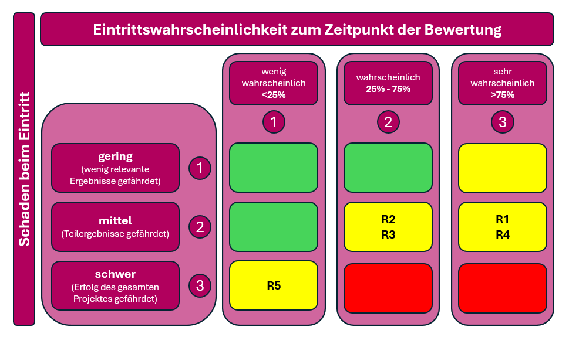

# Risiken

Bei Projektarbeiten sind Risiken grundsätzlich vorhanden. Durch eine frühzeitige Identifikation und Bewertung dieser Risiken können geeignete Massnahmen definiert werden, um negative Auswirkungen auf den Projektverlauf zu minimieren. Ziel der Risikoanalyse ist es, den Projekterfolg sicherzustellen und das Erreichen der definierten Ziele zu unterstützen.

Während der Umsetzung des Projekts wurden die in der nachfolgenden Tabelle dargestellten Risiken identifiziert sowie hinsichtlich ihrer Eintrittswahrscheinlichkeit und potenziellen Auswirkung bewertet.

| ID     | Risiko                                                                                                                                         | Eintritt | Auswirkung  | Massnahme zur Vermeidung / Minderung                                                                   |
| ------ | ---------------------------------------------------------------------------------------------------------------------------------------------- | -------- | ----------- | ------------------------------------------------------------------------------------------------------ |
| **R1** | **Komplexität von Kubernetes**  Schwierigkeiten beim Aufbau und Betrieb des Kubernetes-Clusters können zu Verzögerungen führen           | Mittel   | Hoch        | Verwendung einer lokalen Umgebung (z. B. Minikube), Nutzung von Tutorials und Best Practices           |
| **R2** | **Unklare Evaluation des Developer Hubs**  Fehlende oder ungeeignete Bewertungskriterien können zu einer nicht fundierten Auswahl führen | Mittel   | Mittel-Hoch | Definition klarer Evaluationskriterien (z. B. Funktionalität, Integrationsfähigkeit, Aufwand)          |
| **R3** | **Probleme bei der Integration der Repositories**  Unterschiedliche Strukturen und fehlende Dokumentation erschweren die Integration     | Mittel   | Mittel      | Analyse und Vereinheitlichung der Repository-Strukturen                                                |
| **R4** | **Zeitmanagement / Projektumfang**  Der Gesamtumfang der Arbeit kann zu Zeitengpässen führen                                             | Mittel   | Hoch        | Fokus auf Proof of Concept, Priorisierung der Kernfunktionen, optionale Features nur bei genügend Zeit |
| **R5** | **Datenschutz- oder Sicherheitsprobleme**  Fehlkonfiguration könnte zu ungewolltem Zugriff auf Repositories führen                       | Niedrig  | Hoch        | Ausschliesslich lokaler Betrieb, keine öffentliche Freigabe, Zugriffsbeschränkung                      |

_Übersicht der identifizierten Projektrisiken_

Die identifizierten Risiken wurden zusätzlich in einer grafischen Risikomatrix visualisiert. Diese Darstellung ermöglicht eine übersichtliche Einordnung der Risiken und unterstützt die Priorisierung von Massnahmen.

_Risikomatrix zur Einordnung der Projektrisiken nach Eintrittswahrscheinlichkeit und Schadensauswirkung._

Die Risikoanalyse zeigt, dass sich die meisten identifizierten Risiken im mittleren bis hohen Risikobereich befinden. Besonders die Komplexität der Kubernetes-Umgebung, der mögliche Mehraufwand im Zeitmanagement sowie Unsicherheiten bei der Evaluation und Integration des Developer Hubs erfordern erhöhte Aufmerksamkeit während der Umsetzung des Projekts.

Durch die definierten Massnahmen zur Risikovermeidung und -minderung – wie die Nutzung einer lokalen Testumgebung, die klare Priorisierung der Kernfunktionen sowie die Definition strukturierter Evaluationskriterien – können die identifizierten Risiken jedoch kontrolliert und deren Auswirkungen auf den Projekterfolg reduziert werden. Datenschutz- und Sicherheitsrisiken werden zusätzlich durch den ausschliesslich lokalen Betrieb sowie entsprechende Zugriffsbeschränkungen minimiert.

