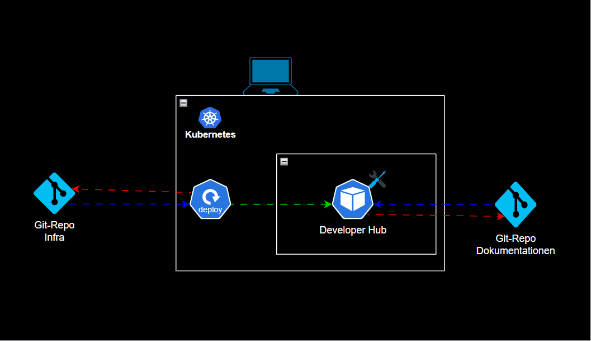

# SEUSAG

Mit der SEUSAG möchte ich die Systemgrenzen aufzeigen, welche bei meinem Projekt auftreten.

[*SEUSAG des Projektes* (Falls Bild nicht richtig angezeigt wird.)](../../ressources/images/seusag.gif)

Das betrachtete System ist ein **Kubernetes-basierter Developer Hub**, welcher innerhalb eines lokalen Kubernetes-Clusters betrieben wird. Der Fokus dieser Semesterarbeit liegt auf der **Konzeption, Evaluation, Integration und Bereitstellung** einer zentralen Plattform zur Verwaltung und Nutzung bestehender Software-Repositories und Entwicklerressourcen.

Im Rahmen der Arbeit wird ein **Proof of Concept (PoC)** umgesetzt, welcher verschiedene bestehende Repositories zentral bündelt und über einen Developer Hub zugänglich macht. Dabei stehen insbesondere die Integration in eine Kubernetes-Umgebung, die strukturierte Bereitstellung von Dokumentationen sowie die Verwaltung der Entwicklungsressourcen im Vordergrund.

---

## Systemgrenze

Die Systemgrenze umfasst alle Komponenten innerhalb des Kubernetes-Clusters:

- Kubernetes als zentrale Laufzeit- und Orchestrierungsplattform
- Deployment-Komponenten zur automatisierten Bereitstellung des Developer Hubs
- Der eingesetzte Developer Hub inklusive Konfiguration und Integration der Repositories
- Lokale Infrastruktur- und Konfigurationsressourcen innerhalb des Clusters

Diese Komponenten werden im Rahmen der Semesterarbeit konzipiert, eingerichtet und getestet.

---

## Umfeld (externe Systeme)

Als externe Systeme gelten:

- **Git-Repositories** zur Verwaltung der Infrastruktur- und Konfigurationsdateien
- **Git-Repositories für Dokumentationen und Projekte**, welche in den Developer Hub integriert werden
- **Container-Registry** zur Bereitstellung benötigter Container-Images
- **Benutzer**, welche über den Developer Hub auf Projekte, Dokumentationen und Entwicklerressourcen zugreifen

Der Betrieb erfolgt ausschliesslich lokal und innerhalb einer geschützten Umgebung, wodurch keine öffentliche Bereitstellung der Systeme vorgesehen ist.