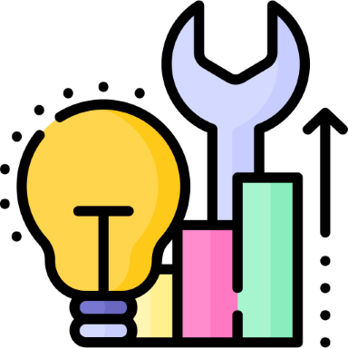
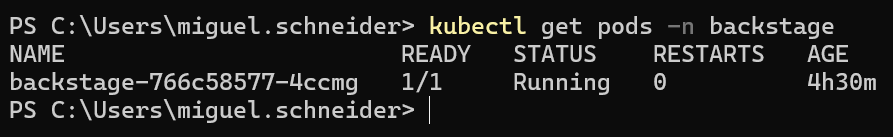
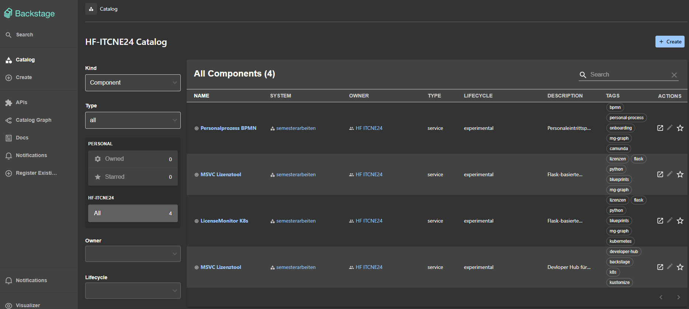
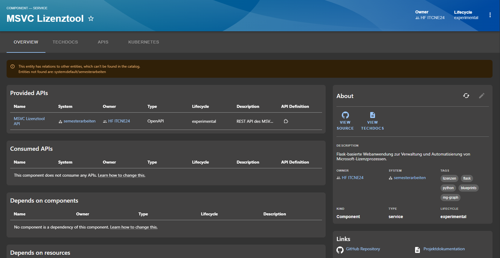
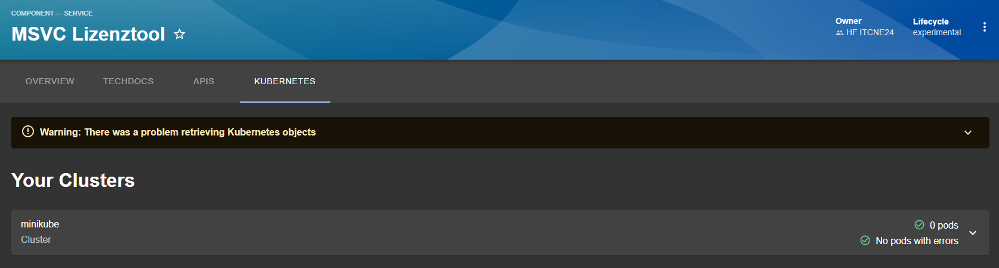
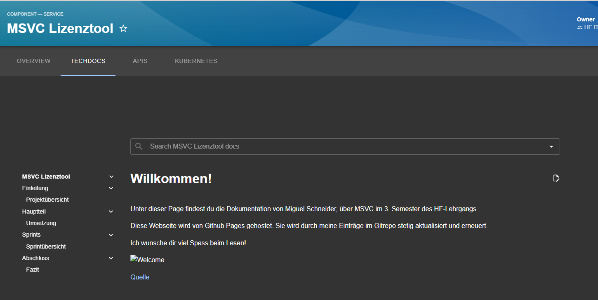

#  Verbessern (Improve) Phase

Die Improve-Phase ist der vierte Schritt in einem Six Sigma Projekt. In dieser Phase werden die in der [Analyze-Phase](./33_analyze.md) identifizierten Hauptursachen für Prozessabweichungen adressiert und Lösungen entwickelt, um diese zu beheben. Ziel ist es, durch gezielte Verbesserungsmassnahmen die Prozessleistung zu optimieren und die identifizierten Probleme nachhaltig zu lösen. Dies umfasst die Anwendung von Kreativitätstechniken, statistischen Methoden und Pilotprojekten, um die Wirksamkeit der vorgeschlagenen Lösungen zu testen und zu validieren.

Ziel der Improve-Phase ist es, die bestehende Anwendung so weiterzuentwickeln, dass sie reproduzierbar bereitgestellt, automatisiert betrieben und nachhaltig gewartet werden kann – im Sinne moderner DevOps- und Cloud-Native-Core-Prinzipien.



[Quelle](../Quellverzeichnis/index.md#improve-phase)

## Umsetzung der Zielarchitektur

Basierend auf den Erkenntnissen der Analysephase wurde die definierte Zielarchitektur schrittweise umgesetzt. Ziel war die Bereitstellung eines Kubernetes-basierten Developer Hubs auf Basis von Backstage, welcher bestehende Software-Repositories zentral verwaltet und Entwicklern einen einheitlichen Zugriff auf Projektdokumentationen, Metadaten sowie Kubernetes-Ressourcen ermöglicht.

Für die Bereitstellung wurde eine Kubernetes-Umgebung aufgebaut, in welcher sämtliche Komponenten von Backstage betrieben werden. Die Kubernetes-Ressourcen werden mithilfe von Kustomize verwaltet. Hierfür wurde die Konfiguration in eine Base-Konfiguration sowie projektspezifische Overlays unterteilt. Dieses Vorgehen ermöglicht eine klare Trennung zwischen allgemeinen Ressourcen und umgebungsspezifischen Anpassungen und erleichtert die Wartung sowie zukünftige Erweiterungen der Plattform.

```text
└───backstage
    │   
    ├───base
    │   │   app-config-production.yaml
    │   │   configmap.yaml
    │   │   deployment.yaml
    │   │   ingress.yaml
    │   │   kustomization.yaml
    │   │   namespace.yaml
    │   │   service.yaml
    │   │   
    │   └───catalog
    │           catalog-info.yaml
    │           groups.yaml
    │           repositories.yaml
    │           users.yaml
    │       
    └───overlays
        └───dev
                kustomization.yaml
                patch-config-url.yaml
                patch-ingress-host.yaml
                patch-resources.yaml
```

_Filestruktur_

Die Bereitstellung von Backstage erfolgt über verschiedene Kubernetes-Ressourcen wie Namespace, Deployment, Service, ConfigMap und Ingress. Diese werden innerhalb einer zentralen `kustomization.yaml` zusammengeführt und gemeinsam bereitgestellt.

```yaml
resources:
  - namespace.yaml
  - configmap.yaml
  - deployment.yaml
  - service.yaml
  - ingress.yaml
```

_Code Beispiel aus Kustomisation.yaml_

Nach erfolgreicher Bereitstellung konnte Backstage innerhalb des Kubernetes-Clusters gestartet und für die anschliessende Integration der Software-Repositories vorbereitet werden.



_Übersicht der aktiven Pods_

---

## Integration der Software-Repositories

Nach der erfolgreichen Bereitstellung von Backstage wurden die bestehenden Software-Repositories in den Developer Hub integriert. Hierfür wurden die Semesterprojekte aus dem zweiten, dritten, vierten und fünften Semester verwendet.

Da die Projekte ursprünglich unabhängig voneinander entwickelt wurden, unterschieden sie sich hinsichtlich ihrer Struktur sowie der vorhandenen Dokumentation. Vor der eigentlichen Integration mussten sämtliche Repositories um die für Backstage erforderlichen Konfigurationsdateien ergänzt werden. 

Ein zentraler Bestandteil war die Erstellung einer `catalog-info.yaml`, welche die notwendigen Metadaten für den Software Catalog bereitstellt.

```yaml
metadata:
  name: hf-itcne24-semarbeit3-msvc-lizenztool
  title: MSVC Lizenztool
  description: Flask-basierte Webanwendung zur Verwaltung und Automatisierung von Microsoft-Lizenzprozessen.
```

_Auszug aus der `catalog-info.yaml`._

Damit die Dokumentationen auch im Developer Hub ersichtlich sind, wurden alle Repositories zusätzlich mit einem `mkdocs.yml` ergänzt. Dadurch konnten die Dokumentationen anschliessend über TechDocs innerhalb von Backstage bereitgestellt werden.

Nach Abschluss dieser Anpassungen konnten sämtliche Semesterprojekte erfolgreich im Software Catalog registriert und zentral verwaltet werden.



---

## Integration der Backstage-Plugins

Für den praktischen Einsatz des Developer Hubs wurden verschiedene Backstage-Plugins integriert.

Der Software Catalog bildet die zentrale Übersicht sämtlicher Softwareprojekte. Ergänzend wurde TechDocs eingerichtet, wodurch die technische Dokumentation direkt innerhalb von Backstage angezeigt werden kann. Zusätzlich erfolgte die Integration des Kubernetes-Plugins, welches Informationen über die bereitgestellten Kubernetes-Ressourcen innerhalb der jeweiligen Projektseite darstellt.

Damit Kubernetes-Ressourcen den entsprechenden Projekten zugeordnet werden können, mussten die erforderlichen Annotationen innerhalb der Repository-Metadaten ergänzt werden.

```yaml
annotations:
    github.com/project-slug: Radball-Migi/HF-ITCNE24-SemArbeit3-MSVC-Lizenztool
    backstage.io/source-location: url:https://github.com/Radball-Migi/HF-ITCNE24-SemArbeit3-MSVC-Lizenztool
    backstage.io/techdocs-ref: url:https://github.com/Radball-Migi/HF-ITCNE24-SemArbeit3-MSVC-Lizenztool/tree/main
    backstage.io/kubernetes-id: hf-itcne24-semarbeit3-msvc-lizenztool
```

_Kubernetes-Annotation innerhalb der `catalog-info.yaml`._

Durch die Kombination dieser Plugins entstand eine zentrale Plattform, welche den Zugriff auf Quellcode, technische Dokumentationen sowie Kubernetes-Ressourcen innerhalb einer gemeinsamen Oberfläche ermöglicht.



_Overview des Projekts mit Linkz zum Github-Repo_



_K8s Ressources, Aktuell wird ein fehler angezeigt, weil der Cluster nicht läuft_



_Techdocs_

---

## Herausforderungen während der Umsetzung

Während der Umsetzung zeigte sich, dass die technische Bereitstellung von Backstage vergleichsweise unkompliziert durchgeführt werden konnte. Der grösste Aufwand entstand vielmehr durch die Integration der verschiedenen Komponenten sowie die Anpassung der bestehenden Software-Repositories.

Da die Semesterprojekte unabhängig voneinander entwickelt wurden, verfügten sie über unterschiedliche Repository-Strukturen und Dokumentationskonzepte. Für die erfolgreiche Integration mussten sämtliche Projekte vereinheitlicht sowie um zusätzliche Metadaten und Dokumentationsdateien ergänzt werden.

Auch die Konfiguration der verschiedenen Plugins erforderte mehrere Iterationen. Insbesondere das Zusammenspiel zwischen Software Catalog, TechDocs und Kubernetes-Plugin machte deutlich, dass bereits kleinere Konfigurationsfehler dazu führen können, dass Projekte oder Kubernetes-Ressourcen nicht korrekt dargestellt werden.

Darüber hinaus erforderte die Einarbeitung in Backstage eine intensive Auseinandersetzung mit der Plattformarchitektur sowie den zahlreichen Konfigurationsmöglichkeiten. Trotz der umfangreichen Dokumentation mussten verschiedene Lösungsansätze praktisch erprobt werden, bevor eine stabile Gesamtlösung erreicht werden konnte.

---

## Verbesserungspotenzial

Der entwickelte Proof of Concept zeigt, dass sich Backstage grundsätzlich als zentrale Entwicklerplattform eignet und die Integration bestehender Software-Repositories technisch möglich ist. Gleichzeitig wurden während der Umsetzung verschiedene Aspekte identifiziert, welche einer produktiven Einführung entgegenstehen.

Der grösste Aufwand entsteht nicht durch die technische Bereitstellung der Plattform, sondern durch die notwendige Standardisierung der bestehenden Softwareprojekte. Damit Backstage sein volles Potenzial entfalten kann, müssen sämtliche Repositories einer einheitlichen Struktur folgen und konsequent mit standardisierten Metadaten sowie einer konsistenten Dokumentation gepflegt werden.

Für die ISE AG würde dies bedeuten, dass bestehende Projekte umfassend überarbeitet und zukünftige Projekte nach verbindlichen Richtlinien entwickelt werden müssten. Zusätzlich wäre eine Schulung der Entwickler erforderlich, damit die definierten Repository-Strukturen, Dokumentationsstandards sowie die benötigten Metadaten konsequent angewendet werden.

Neben den organisatorischen Herausforderungen bestehen auch technische Erweiterungsmöglichkeiten. Beispielsweise könnten zusätzliche Backstage-Plugins integriert oder weitere Unternehmenssysteme angebunden werden. Diese Erweiterungen würden den Funktionsumfang erhöhen, ändern jedoch nichts am grundlegenden Aufwand für die Einführung und Pflege der Plattform.

Aus heutiger Sicht überwiegt daher der organisatorische Einführungsaufwand den erwarteten Nutzen für die ISE AG. Insbesondere die notwendige Standardisierung der bestehenden Softwarelandschaft stellt einen erheblichen Aufwand dar, welcher im Verhältnis zum erzielten Mehrwert kritisch bewertet werden muss.

---

## Fazit der Improve-Phase

Im Rahmen der Improve-Phase konnte ein funktionsfähiger Proof of Concept erfolgreich umgesetzt werden. Backstage wurde innerhalb einer Kubernetes-Umgebung bereitgestellt und die bestehenden Semesterprojekte konnten erfolgreich integriert werden. Dadurch konnte die technische Machbarkeit eines Kubernetes-basierten Developer Hubs nachgewiesen werden.

Die Umsetzung zeigte jedoch auch, dass die technische Installation der Plattform lediglich einen Teil des Gesamtaufwands darstellt. Der deutlich grössere Aufwand entsteht durch die notwendige Vereinheitlichung bestehender Software-Repositories sowie die Einführung standardisierter Dokumentations- und Metadatenkonzepte.

Aus technischer Sicht erfüllt der entwickelte Proof of Concept die definierten Anforderungen und zeigt die Möglichkeiten einer zentralen Entwicklerplattform auf. Für eine produktive Einführung innerhalb der ISE AG wären jedoch umfangreiche organisatorische Massnahmen erforderlich. Aufgrund des hohen Aufwands für die Standardisierung bestehender Projekte sowie der notwendigen Anpassung interner Entwicklungsprozesse erscheint eine Einführung der Plattform zum aktuellen Zeitpunkt nur bedingt wirtschaftlich.

Dennoch liefert der entwickelte Proof of Concept wertvolle Erkenntnisse über die Möglichkeiten und Grenzen eines Kubernetes-basierten Developer Hubs und bildet eine fundierte Entscheidungsgrundlage für zukünftige Vorhaben im Bereich zentralisierter Entwicklerplattformen.