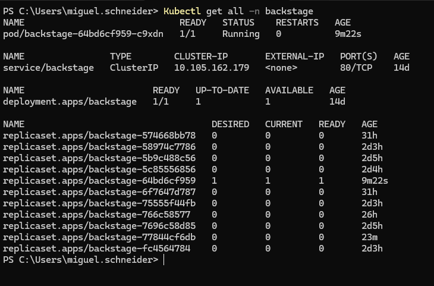
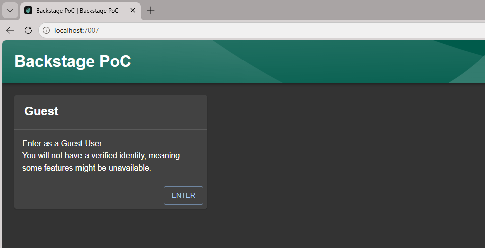
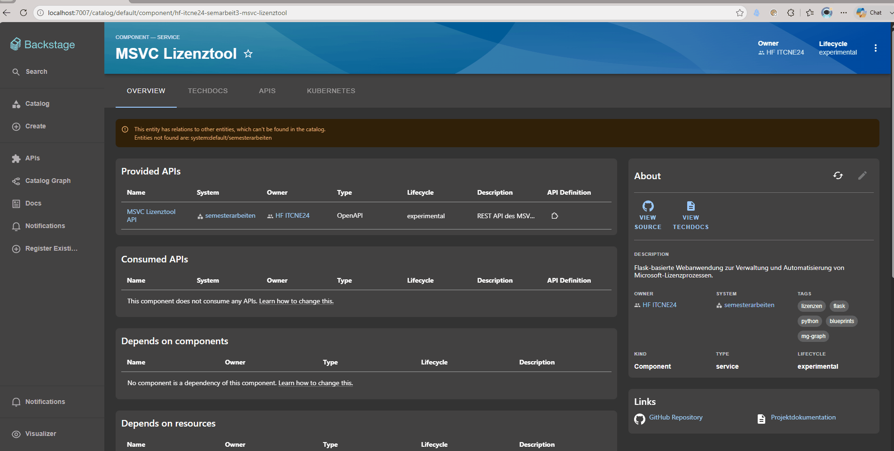

#  Kontrollieren (Control) Phase

Die Control-Phase dient der Überprüfung, ob die im Rahmen der Semesterarbeit entwickelte Lösung die definierten Projektziele erfüllt und die implementierten Funktionen zuverlässig arbeiten. Im Gegensatz zur Improve-Phase, welche die Umsetzung des Proof of Concept beschreibt, steht in dieser Phase die Validierung der entwickelten Lösung im Vordergrund.

Hierzu werden die zentralen Komponenten des Developer Hubs systematisch überprüft und anhand der zuvor definierten Projektziele bewertet. Gleichzeitig wird betrachtet, ob die entwickelte Lösung für den vorgesehenen Einsatzzweck geeignet ist und welche organisatorischen Aspekte für einen langfristigen Betrieb berücksichtigt werden müssten.

[Quelle](../Quellverzeichnis/index.md#control-phase) 
## Kontrollmechanismen

Zur Überprüfung des entwickelten Proof of Concept wurden verschiedene Kontrollmechanismen definiert. Diese dienen dazu, sowohl die technische Funktionalität als auch die Zielerreichung der implementierten Lösung zu überprüfen.

| Kontrollmechanismus | Ziel der Überprüfung |
|--------------------|----------------------|
| Kubernetes-Cluster | Überprüfung der erfolgreichen Bereitstellung aller Backstage-Komponenten |
| Backstage | Erreichbarkeit und grundlegende Funktionalität der Plattform |
| Software Catalog | Korrekte Integration der Semesterprojekte |
| TechDocs | Darstellung der technischen Dokumentationen |
| Kubernetes-Plugin | Anzeige der Kubernetes-Ressourcen innerhalb der Projekte |
| GitHub-Integration | Verknüpfung der Projekte mit den jeweiligen Repositories |
| Projektziele | Bewertung der Zielerreichung |

---

## Validierung der Kubernetes-Umgebung

Die Grundlage des entwickelten Proof of Concept bildet der Kubernetes-Cluster, auf welchem Backstage betrieben wird. Daher wurde zunächst überprüft, ob sämtliche Kubernetes-Ressourcen erfolgreich erstellt wurden und fehlerfrei ausgeführt werden.

Hierzu wurden die laufenden Pods, Deployments sowie Services kontrolliert. Alle benötigten Komponenten konnten erfolgreich gestartet werden und befanden sich während der Validierung im Status **Running** beziehungsweise **Ready**.

_Overview Namespace `Backstage`_

Zusätzlich wurde überprüft, ob die Anwendung über den konfigurierten Ingress erreichbar ist und sämtliche Kubernetes-Ressourcen ordnungsgemäss miteinander kommunizieren.

_Landingpage Backstage_

Die Überprüfung bestätigt, dass die technische Grundlage für den Betrieb des Developer Hubs erfolgreich geschaffen wurde.

---

## Validierung des Developer Hubs

Nach erfolgreicher Bereitstellung der Kubernetes-Umgebung wurde die Funktionalität von Backstage überprüft.

Hierbei wurde insbesondere kontrolliert, ob die Plattform erfolgreich gestartet werden kann und sämtliche konfigurierten Plugins verfügbar sind. Darüber hinaus wurde geprüft, ob die Navigation innerhalb der Plattform sowie der Zugriff auf die einzelnen Projektseiten fehlerfrei funktionieren.

Während der Validierung konnten keine funktionalen Einschränkungen festgestellt werden. Die Benutzeroberfläche wurde korrekt geladen und sämtliche konfigurierten Komponenten standen wie vorgesehen zur Verfügung.

_Overview Service-Catalog_

---

## Validierung der Repository-Integration

Ein wesentliches Ziel des Projekts bestand in der zentralen Verwaltung bestehender Software-Repositories.

Im Rahmen der Validierung wurde überprüft, ob sämtliche integrierten Semesterprojekte erfolgreich im Software Catalog dargestellt werden. Hierzu wurden die Semesterprojekte aus dem zweiten bis fünften Semester kontrolliert.

Alle integrierten Projekte wurden erfolgreich erkannt und mit den hinterlegten Metadaten im Software Catalog dargestellt. Zusätzlich konnten die jeweiligen GitHub-Repositories direkt über Backstage aufgerufen werden.

_Links zum Repo öffnen_

Die erfolgreiche Darstellung bestätigt, dass die Integration der bestehenden Software-Repositories erfolgreich umgesetzt wurde.

---

## Validierung der technischen Dokumentation

Ein weiterer Schwerpunkt der Validierung bestand in der Überprüfung der integrierten TechDocs.

Hierbei wurde kontrolliert, ob sämtliche Dokumentationen korrekt generiert und innerhalb von Backstage angezeigt werden. Zusätzlich wurde überprüft, ob die Navigation innerhalb der Dokumentationen funktioniert und die Inhalte vollständig dargestellt werden.

Die Validierung zeigte, dass sämtliche integrierten Dokumentationen erfolgreich aufgerufen werden können und den jeweiligen Softwareprojekten korrekt zugeordnet sind.

_Techdocs_

Dadurch konnte nachgewiesen werden, dass die technische Dokumentation zentral innerhalb des Developer Hubs bereitgestellt wird.

---

## Bewertung der Projektziele

Im letzten Schritt wurden die zu Beginn der Semesterarbeit definierten Projektziele mit den tatsächlich erzielten Ergebnissen verglichen.

| Projektziel | Bewertung | Ergebnis |
|--------------|-----------|----------|
| Aufbau und Bereitstellung eines Kubernetes-Clusters | Der Kubernetes-Cluster wurde erfolgreich aufgebaut und bildet die Grundlage für den Betrieb von Backstage. | ✅ Erreicht |
| Evaluation und Auswahl eines geeigneten Developer Hubs | Mehrere Developer-Hub-Lösungen wurden evaluiert und anhand definierter Kriterien bewertet. Backstage wurde als geeignetste Lösung ausgewählt. | ✅ Erreicht |
| Implementierung und Deployment des ausgewählten Developer Hubs | Backstage wurde erfolgreich innerhalb des Kubernetes-Clusters bereitgestellt und konfiguriert. | ✅ Erreicht |
| Integration und zentrale Verwaltung von Software-Repositories | Die Semesterprojekte aus dem zweiten bis fünften Semester wurden erfolgreich integriert und zentral innerhalb des Software Catalogs verwaltet. | ✅ Erreicht |
| Dokumentation sowie konzeptionelle KI-Evaluierung | Die gesamte Umsetzung wurde dokumentiert. Zusätzlich wurde eine konzeptionelle Betrachtung möglicher KI-Erweiterungen durchgeführt. | ✅ Erreicht |

Die Validierung zeigt, dass sämtliche zu Beginn definierten Projektziele erreicht werden konnten. Der entwickelte Proof of Concept erfüllt somit den vorgesehenen Projektumfang.

---

## Bewertung der entwickelten Lösung

Obwohl die technischen Projektziele vollständig erreicht wurden, zeigte die praktische Umsetzung auch verschiedene organisatorische Herausforderungen.

Die technische Bereitstellung von Backstage innerhalb einer Kubernetes-Umgebung konnte erfolgreich umgesetzt werden. Der deutlich grössere Aufwand entstand jedoch bei der Integration und Standardisierung der bestehenden Software-Repositories.

Damit Backstage seinen vollen Funktionsumfang bereitstellen kann, müssen sämtliche Projekte einer einheitlichen Repository-Struktur folgen und mit standardisierten Metadaten versehen werden. Für bestehende Projekte würde dies einen erheblichen Migrationsaufwand bedeuten. Zusätzlich müssten Entwickler hinsichtlich der neuen Repository-Struktur sowie der Dokumentationsrichtlinien geschult werden.

Aus technischer Sicht konnte die Machbarkeit des gewählten Lösungsansatzes erfolgreich nachgewiesen werden. Für einen produktiven Einsatz innerhalb der ISE AG wäre jedoch zunächst zu prüfen, ob der organisatorische Aufwand in einem angemessenen Verhältnis zum erwarteten Nutzen steht.

---

## Fazit der Control-Phase

Die im Rahmen der Control-Phase durchgeführte Validierung bestätigt die erfolgreiche Umsetzung des entwickelten Proof of Concept. Sämtliche definierten Projektziele konnten erreicht und die wesentlichen Funktionen des Developer Hubs erfolgreich überprüft werden.

Die technische Umsetzung zeigt, dass sich Backstage grundsätzlich als zentrale Plattform zur Verwaltung von Softwareprojekten eignet. Gleichzeitig wurde deutlich, dass der langfristige Erfolg einer solchen Lösung wesentlich von einer konsequenten Standardisierung der Software-Repositories sowie der Einhaltung definierter Entwicklungs- und Dokumentationsrichtlinien abhängt.

Die gewonnenen Erkenntnisse bilden somit eine fundierte Grundlage für die abschliessende Bewertung der Semesterarbeit sowie für zukünftige Entscheidungen hinsichtlich einer möglichen Einführung eines Developer Hubs innerhalb der ISE AG.